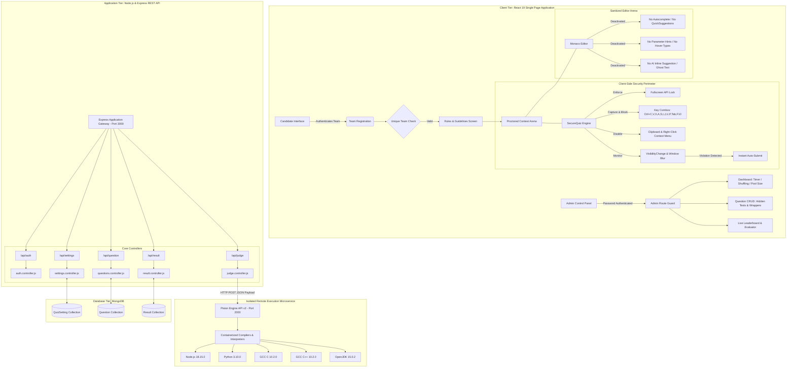
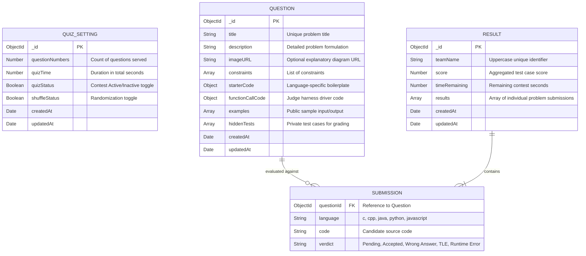
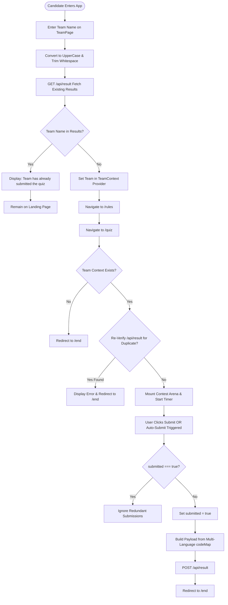
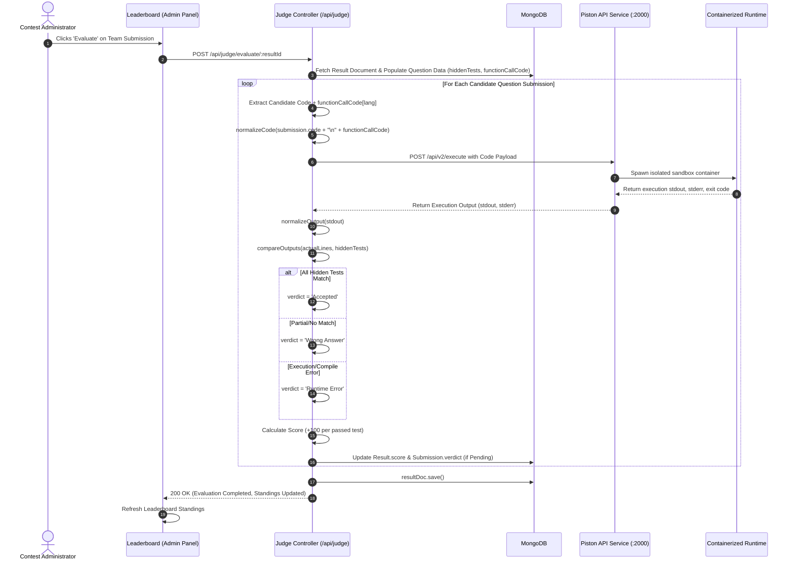
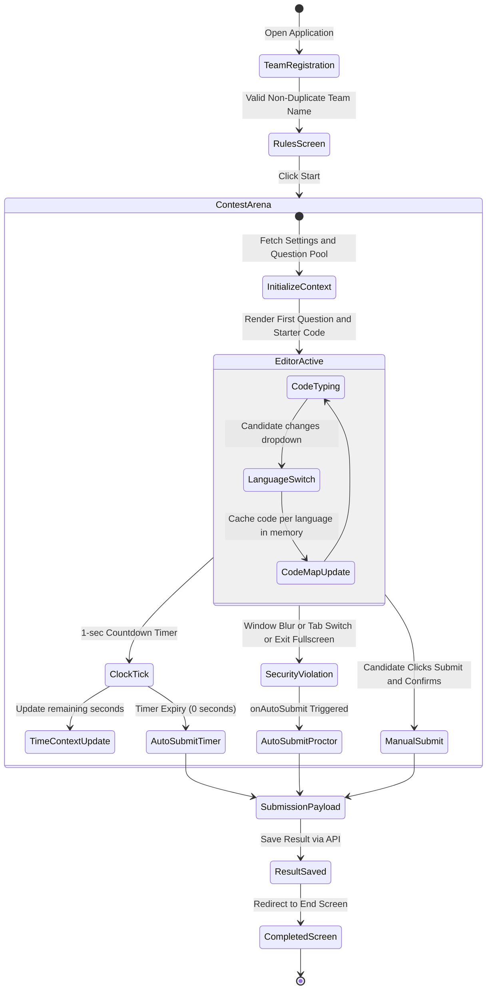

# SOFTWARE TECHNICAL DOCUMENTATION & SPECIFICATION
## FOR COPYRIGHT REGISTRATION & INTELLECTUAL PROPERTY AUDIT

---

### **TITLE OF WORK**: **Code Ke Boss – Round 2 (Codex Competitive Programming & Evaluation Platform)**
* **Document Type**: Comprehensive Software Architecture, Algorithmic Design, and Security Validation Specification
* **Category of Work**: Computer Software / Literary Work (Source Code & Architecture)
* **Creation / Contest Year**: 2025–2026
* **Organization / Academic Origin**: Uttaranchal School of Computing Sciences (USCS), Uttaranchal University
* **Core Technology Stack**: MERN Stack (MongoDB, Express.js, React.js 19, Node.js) + Piston Sandbox Engine (Docker/Microservice RCE) + Monaco Code Editor + Tailwind CSS + Framer Motion
* **Target Environment**: Web Browser (Client-Side Proctored) & Isolated Containerized Execution Environment (Server-Side)

---

## 1. EXECUTIVE SUMMARY & SYSTEM OBJECTIVE

### 1.1 Problem Statement & Background
Competitive programming events and high-stakes coding assessments often suffer from cheating, code-leakage, unmonitored browser switching, unauthorized external assistance, and delayed evaluation cycles. Traditional online quiz engines lack automated remote compilation for low-level and high-level languages alike (C, C++, Java, Python, JavaScript) while simultaneously providing client-side lock-down proctoring.

### 1.2 The Innovation
**Code Ke Boss – Round 2 (Codex Platform)** is an end-to-end, enterprise-grade, web-based competitive coding and proctoring ecosystem. It provides:
1. **Isolated Client-Side Anti-Cheating & Lockdown Engine**: Fullscreen enforcement, multi-combination keyboard interception, clipboard isolation, and zero-tolerance focus/visibility loss auto-submission.
2. **Hardened Monaco Code Editor**: Autocomplete, IntelliSense, hover parameter hints, and AI ghost suggestions are completely neutralized to force authentic algorithmic reasoning.
3. **Containerized Code Sandbox (Piston Engine Integration)**: High-speed, secure, multi-language execution running against invisible, server-side hidden test suites.
4. **Code Injection Wrapper Architecture**: Separation of candidate solution function from driver execution code (`functionCallCode`), preventing candidate tampering with the grading harness.
5. **No Re-submission & Idempotency System**: Prevents duplicate entries via normalized team-name database matching at entry and within contest sessions.
6. **Centralized Administrative Command Center**: Real-time parameter reconfiguration (question pooling, dynamic time limits, randomized shuffling), live code inspection, and one-click batch automated grading.

---

## 2. SYSTEM ARCHITECTURE & COMPONENT TOPOLOGY

The platform operates on a decoupled client-server architecture with an external sandboxed microservice for code execution.

### 2.1 High-Level Architecture Diagram



---

## 3. COMPREHENSIVE DATA DICTIONARY & SCHEMAS

The database tier is modeled in MongoDB using Mongoose ODM, enforcing strict schema validation and referential integrity.

### 3.1 Entity-Relationship (ER) Diagram



### 3.2 Schema Definitions & Constraints

#### 1. `Question` Model (`question.model.js`)
* **`title`**: String, required, trimmed.
* **`description`**: String, required.
* **`imageURL`**: String (optional hosted URL e.g. via ImgBB).
* **`examples`**: Array of subdocuments containing `{ input: String, output: String, explanation: String }`.
* **`constraints`**: Array of Strings describing mathematical or resource limits.
* **`hiddenTests`**: Array of subdocuments `{ input: String, output: String }`. These remain inaccessible to candidates during contest runtime.
* **`starterCode`**: Language map (`javascript`, `java`, `python`, `c`, `cpp`) containing function signatures displayed in candidate's Monaco Editor.
* **`functionCallCode`**: Language map (`javascript`, `java`, `python`, `c`, `cpp`) containing driver harness code executing hidden test cases and outputting results to stdout.

#### 2. `Result` Model (`results.model.js`)
* **`teamName`**: String, required (normalized uppercase format).
* **`score`**: Number, default: 0 (calculated at 100 points per passed hidden test case).
* **`timeRemaining`**: Number, required (contest clock remaining in seconds at moment of submission).
* **`results`**: Array of embedded `submissionSchema` documents.

#### 3. `Submission` Sub-Schema (`subschema.model.js`)
* **`questionId`**: `mongoose.Schema.Types.ObjectId`, references `Question`, required.
* **`language`**: String enum `["c", "cpp", "java", "python", "javascript"]`, required.
* **`code`**: String, required (raw candidate code).
* **`verdict`**: String enum `["Pending", "Accepted", "Wrong Answer", "TLE", "Runtime Error"]`, default: `"Pending"`.

#### 4. `QuizSetting` Model (`settings.model.js`)
* **`questionNumbers`**: Number, required, minimum 1 (number of questions pulled from pool).
* **`quizTime`**: Number, required, minimum 1 (contest duration in seconds).
* **`quizStatus`**: Boolean, default: false.
* **`shuffleStatus`**: Boolean, default: false (controls pseudo-random shuffling algorithm).

---

## 4. DEEP-DIVE: SECURITY, ANTI-CHEATING & PROCTORING SUBSYSTEM

The security subsystem is implemented primarily within [`SecureQuiz.jsx`](file:///c:/Users/Asus/Web%20Developement/Codex/CODEX%20-%20BY%20ME/Codex-SecoundRound-Website/frontend/src/Components/QuizPage/SecureQuiz.jsx) and complemented by [`CodeEditor.jsx`](file:///c:/Users/Asus/Web%20Developement/Codex/CODEX%20-%20BY%20ME/Codex-SecoundRound-Website/frontend/src/Components/QuizPage/CodeEditor.jsx).

```mermaid
sequenceDiagram
    autonumber
    actor Candidate
    participant Browser as Browser DOM / Window
    participant SecureQuiz as SecureQuiz Engine
    participant QuizPage as Quiz Component
    participant Backend as Express API (/api/result)

    Candidate->>Browser: Enters /quiz Route
    SecureQuiz->>Browser: Request Fullscreen API (Cross-Vendor)
    SecureQuiz->>Browser: Register Capture-Phase Listeners (keydown, copy, paste, blur, visibilitychange)
    
    rect rgb(30, 30, 45)
        note over Browser,SecureQuiz: Event Interception & Anti-Tamper Monitoring
        Candidate->>Browser: Types Key Combo (e.g., Ctrl+C / Ctrl+V / Alt+Tab / Ctrl+Shift+I)
        Browser->>SecureQuiz: keydown event (Capture Phase)
        SecureQuiz->>Browser: preventDefault() + stopImmediatePropagation()
        note right of SecureQuiz: Keystroke completely neutralized
    end

    rect rgb(60, 20, 20)
        note over Candidate,Backend: Violation Flow: Tab Switch or Window Blur or Exit Fullscreen
        Candidate->>Browser: Switches Tab / Minimizes / Exits Fullscreen
        Browser->>SecureQuiz: Triggers 'visibilitychange' OR 'blur' OR 'fullscreenchange'
        SecureQuiz->>QuizPage: Invokes onAutoSubmit()
        QuizPage->>QuizPage: setSubmitted(true) - Lock UI
        QuizPage->>Backend: POST /api/result with current codeMap
        Backend-->>QuizPage: 200 OK (Submission Logged)
        QuizPage->>Browser: Redirect Candidate to /end (Session Terminated)
    end
```



### 4.1 Cross-Browser Fullscreen Enforcement
On component mounting, the engine issues a fullscreen request across all vendor implementations:
```javascript
const enterFullscreen = async () => {
  const el = document.documentElement;
  if (el.requestFullscreen) await el.requestFullscreen();
  else if (el.webkitRequestFullscreen) await el.webkitRequestFullscreen();
  else if (el.mozRequestFullScreen) await el.mozRequestFullScreen();
  else if (el.msRequestFullscreen) await el.msRequestFullscreen();
};
```
If the user cancels fullscreen mode through the Escape key or browser navigation controls, the `fullscreenchange` event listener fires and executes `onAutoSubmit()`.

### 4.2 Aggressive Capture-Phase Keyboard Interception
Browsers evaluate event listeners in two phases: **Capture** and **Bubble**. The anti-cheating engine registers event listeners with `{ capture: true }`, ensuring it intercepts keystrokes before any browser extension, developer tools shortcut, or code editor shortcuts can process them:
* **Blocked Modifiers**: Any keystroke with `Ctrl` or `Cmd (Meta)` modifier combined with:
  `C` (Copy), `X` (Cut), `V` (Paste), `A` (Select All), `S` (Save), `P` (Print), `F` (Find), `U` (View Source), `I` (Inspect), `J` (Console), `O` (Open), `W` (Close Window), `T` (New Tab), `Y` (Redo), `R` (Reload), `Tab` (Tab traversal), `Escape`.
* **Blocked Context Keys**: `ContextMenu` key and `Shift + F10` (which triggers OS-level right click).
* **Execution Neutralization**:
  ```javascript
  e.preventDefault?.();
  e.stopPropagation?.();
  if (e.stopImmediatePropagation) e.stopImmediatePropagation();
  ```

### 4.3 Clipboard Neutralization & Right-Click Disabling
Direct clipboard events are trapped in the capture phase and suppressed:
* `contextmenu`: Suppresses custom and native right-click menus.
* `copy`: Prevents copying problem descriptions, constraints, or starter code.
* `cut`: Prevents cutting content.
* `paste`: Prevents pasting code copied from external IDEs, AI engines, or cheat repositories.

### 4.4 Focus Loss & Visibility Change Auto-Submission
1. **`visibilitychange`**: When the browser window is minimized or the user switches tabs, `document.visibilityState` shifts to `"hidden"`. This immediately calls `onAutoSubmit()`.
2. **`blur`**: When the browser window loses operating system focus (e.g. user clicks onto a secondary monitor, opens Discord, WhatsApp, ChatGPT desktop, or terminal), `window.onBlur` fires, immediately terminating the test and submitting the current state.

### 4.5 Sanitized Monaco Code Editor De-Assistance Configuration
In [`CodeEditor.jsx`](file:///c:/Users/Asus/Web%20Developement/Codex/CODEX%20-%20BY%20ME/Codex-SecoundRound-Website/frontend/src/Components/QuizPage/CodeEditor.jsx), Microsoft's Monaco Editor is deliberately stripped of all automated developer assistance:
* `hover: { enabled: false }`: Strips type signatures, documentation popups, and lint previews.
* `quickSuggestions: false`: Disables the automatic popup menu proposing variable and keyword completions.
* `parameterHints: { enabled: false }`: Blocks function parameter hints.
* `suggestOnTriggerCharacters: false`: Prevents dots (`.`) or arrows (`->`) from opening method listings.
* `acceptSuggestionOnEnter: "off"` & `tabCompletion: "off"`: Prevents autocomplete insertion.
* `wordBasedSuggestions: false`: Disables dictionary-based guessing of existing tokens.
* `inlineSuggest: { enabled: false }`: Explicitly disables Copilot, GitHub Ghost Text, or AI inline completion extensions.

---

## 5. VALIDATION, INTEGRITY & NO RE-SUBMISSION MECHANISMS

Integrity verification occurs across multiple levels from initial team login to final grade persistence.

### 5.1 Unique Team & No Re-submission Validation Flow



### 5.2 Specific Validation Steps in Code

1. **Pre-Contest Validation (`TeamPage.jsx`)**:
   ```javascript
   const trimmedName = teamname.trim().toUpperCase();
   const alreadySubmitted = results.some(
     (r) => r.teamName?.toUpperCase() === trimmedName
   );
   if (alreadySubmitted) {
     toast.error("Team has already submitted the quiz");
     return;
   }
   ```
2. **In-Flight URL Bypass Guard (`Quiz.jsx`)**:
   If a participant bookmarks `/quiz` or navigates directly without passing through `TeamPage`:
   ```javascript
   if (!team) {
     navigate("/end");
     return null;
   }
   ```
   Even if `team` is somehow populated in memory, an asynchronous verification call checks MongoDB:
   ```javascript
   const { data } = await api.get("/result");
   const alreadySubmitted = data.some(
     (r) => r.teamName?.toUpperCase() === team?.toUpperCase(),
   );
   if (alreadySubmitted) {
     toast.error("Team has already submitted the quiz");
     navigate("/end");
   }
   ```
3. **Idempotency Guard During Submission (`Quiz.jsx`)**:
   Rapid double-clicking or network retries are prevented through synchronous flag locks:
   ```javascript
   const [submitted, setSubmitted] = useState(false);
   const submitQuiz = async () => {
     if (submitted) return;
     setSubmitted(true);
     // ... proceeds with API dispatch
   };
   ```
4. **Backend Database Evaluation Guard (`judge.controller.js`)**:
   When administrators trigger test grading via `/api/judge/evaluate/:resultId`, the score is calculated and updated **only if the current verdict is "Pending"**:
   ```javascript
   if (!submission.verdict || submission.verdict === "Pending") {
     const idx = resultDoc.results.findIndex(
       (r) => r.questionId.toString() === submission.questionId.toString() &&
              r.language === language,
     );
     if (idx !== -1) {
       resultDoc.results[idx].verdict = verdict;
       resultDoc.results[idx].testResults = comparisonResults;
       resultDoc.score += scoreAdded;
       didUpdate = true;
     }
   }
   ```
   This guarantees that repeatedly clicking "Evaluate" on the administrator dashboard will **never** erroneously double-count points.

---

## 6. REMOTE CODE EXECUTION & EVALUATION ENGINE (PISTON INTEGRATION)

The automated grading engine integrates with the Piston Execution API. Piston runs as an isolated microservice (via local Docker container or daemon) listening on `http://localhost:2000`.

### 6.1 Remote Code Execution Architecture



### 6.2 Multi-Language Matrix & Execution Configuration

The system defines language versions and execution file naming in [`piston.config.js`](file:///c:/Users/Asus/Web%20Developement/Codex/CODEX%20-%20BY%20ME/Codex-SecoundRound-Website/backend/src/services/piston.config.js):

| Language | Piston Identifier | Engine Version | File Name | Execution Characteristics |
| :--- | :--- | :--- | :--- | :--- |
| **JavaScript** | `javascript` | `18.15.0` | `main.js` | Direct Node.js V8 execution |
| **Python** | `python` | `3.10.0` | `main.py` | CPython 3.10 runtime |
| **C** | `c` | `10.2.0` | `main.c` | GCC 10.2 compiled binary |
| **C++** | `c++` | `10.2.0` | `main.cpp` | G++ 10.2 `-std=c++17` |
| **Java** | `java` | `15.0.2` | `Solution.java` | OpenJDK Java Virtual Machine |

### 6.3 Code Normalization Pipeline
Before dispatching code to Piston, newline discrepancies between operating systems (Windows `\r\n` vs UNIX `\n`) and superfluous empty trailing boundaries are sanitized:
```javascript
const normalizeCode = (code) => {
  if (!code) return "";
  return code
    .replace(/\r\n/g, "\n")
    .split("\n")
    .map((line) => line.trimEnd())
    .filter((line, i, arr) => {
      if (i === 0 || i === arr.length - 1) return line.trim() !== "";
      return true;
    })
    .join("\n")
    .trim();
};
```

### 6.4 Output Sanitization & Comparison Logic
Standardizing program outputs accounts for whitespace variations, bracket differences in array outputs, and boolean formatting variations across programming languages (e.g. Python `True` vs C/C++ `1` or JS `true`):
```javascript
const normalizeOutput = (text) => {
  if (!text) return [];
  return text
    .trim()
    .replace(/\r\n/g, "\n")
    .split("\n")
    .map((line) => {
      const val = line.trim().toLowerCase();
      if (val === "true" || val === "1") return "true";
      if (val === "false" || val === "0") return "false";
      return val
        .replace(/[\[\]]/g, "")
        .replace(/\s*,\s*/g, " ")
        .replace(/\s+/g, " ")
        .trim();
    })
    .filter(Boolean);
};
```

### 6.5 The Code Wrapper Injection Paradigm
In competitive platforms, exposing `main()` or input reading logic to candidates allows them to manipulate grading streams. Codex solves this using a **Two-Part Code Assembly Scheme**:
1. **Candidate Solution (`starterCode`)**: Candidate implements only the algorithmic core (e.g., `function solve(arr) { ... }`).
2. **Hidden Driver Harness (`functionCallCode`)**: The administrator inputs hidden driver code per language.
3. **Synthesis**: The judge concatenates:
   $$\text{Final Executable} = \text{normalizeCode}(\text{Candidate Code} + \text{Driver Harness})$$
   The driver harness feeds all hidden test cases sequentially, writing output lines to `stdout`.

---

## 7. ADMINISTRATIVE ORCHESTRATION & CONTROL PANEL

The administrator subsystem provides complete governance over the contest lifecycle.

### 7.1 Security & Route Authentication
* **Access URL**: `/adminAuth`
* **Protection Middleware / Route Guard**: [`AdminRoute.jsx`](file:///c:/Users/Asus/Web%20Developement/Codex/CODEX%20-%20BY%20ME/Codex-SecoundRound-Website/frontend/src/AdminRoute.jsx) guards `/adminPannel/*`.
* **Credential Validation**: Compares entered password against `process.env.ADMIN_PASSWORD`.
* **Session Storage**: Sets `localStorage.setItem("isAdmin", "true")` upon successful backend authentication.

### 7.2 Contest Control Panel (`QuizDashboard.jsx`)
Administrators can dynamically control:
1. **Total Contest Time**: Inputs for Hours, Minutes, and Seconds converted into integer seconds:
   $$\text{Total Seconds} = (\text{hrs} \times 3600) + (\text{min} \times 60) + \text{sec}$$
2. **Question Pool Slicing**: Controls how many questions from the active database pool are served to contestants (`slice(0, questionNumbers)`).
3. **Randomized Shuffling Algorithm**:
   When `shuffleStatus: true`, the frontend randomly shuffles the questions on load using pseudo-random sorting (`questions.sort(() => Math.random() - 0.5)`), ensuring adjacent teams do not receive problems in the same order.
4. **Contest Status Toggle**: Master enable/disable switch for the event.

### 7.3 Question Lifecycle Management (CRUD)
1. **Add Question (`AddQuestion.jsx`, `QuestionForm.jsx`)**:
   * Basic Details: Title, Description, ImgBB hosted explanation image.
   * Examples: Dynamic list of inputs, outputs, and explanations.
   * Constraints: Dynamic list of mathematical and performance boundaries.
   * Hidden Test Cases: Private inputs and outputs used by the Piston Judge.
   * Language Configuration: Per-language `starterCode` and `functionCallCode` for C, C++, Java, Python, and JavaScript.
2. **Edit & Delete Question (`EditQuestion.jsx`, `QuestionBox.jsx`)**:
   * Circular selector buttons (`QuestionBox`) for rapid navigation.
   * Live preview panel (`QuestionView.jsx`) with syntax highlighting using `react-syntax-highlighter` (Prism Atom Dark theme).
   * Update and Delete operations directly modifying the MongoDB database.

### 7.4 Live Leaderboard & Submission Inspection (`Leadboard.jsx`, `Detailed.jsx`)
* **Sorting Algorithm**:
  ```javascript
  const sortByScoreAndTime = (results) => {
    return [...results].sort((a, b) => {
      if (b.score !== a.score) {
        return b.score - a.score; // Primary: Higher score first
      }
      return b.timeRemaining - a.timeRemaining; // Secondary: More time remaining first
    });
  };
  ```
* **One-Click Automated Grading**:
  Clicking "Evaluate" triggers the remote judge asynchronously, displays loading state spinners, executes all hidden tests in Piston, updates database verdicts, and re-renders the leaderboard.
* **Granular Submission Audit (`Detailed.jsx`)**:
  Inspects the full candidate submission:
  * Team metadata, score, and time elapsed ($T_{\text{taken}} = T_{\text{total}} - T_{\text{remaining}}$).
  * Problem-by-problem code breakdown rendered in formatted Prism syntax highlighter.
  * Verdict badges (`Accepted`, `Wrong Answer`, `Runtime Error`).

---

## 8. CANDIDATE WORKFLOW & STATE MANAGEMENT

### 8.1 State Management Architecture



### 8.2 Client-Side Code State Isolation (`codeMap`)
In [`Quiz.jsx`](file:///c:/Users/Asus/Web%20Developement/Codex/CODEX%20-%20BY%20ME/Codex-SecoundRound-Website/frontend/src/Components/QuizPage/Quiz.jsx), when a candidate switches between questions or programming languages, their code is not lost. The application uses a multi-dimensional state map:
```javascript
codeMap[questionId] = {
  javascript: "...",
  python: "...",
  c: "...",
  cpp: "...",
  java: "...",
  language: "python" // currently selected language for this question
};
```
When submitting, `buildPayload()` iterates over each loaded question, extracting the candidate's custom code or falling back to the default `starterCode` for the chosen language.

---

## 9. REST API SPECIFICATION

The backend exposes a structured RESTful API configured with Express.

### 9.1 API Route Directory

| Method | Endpoint | Description | Protected | Key Payload / Params |
| :--- | :--- | :--- | :---: | :--- |
| `POST` | `/api/auth` | Verifies administrator access | No | `{ password: string }` |
| `GET` | `/api/settings` | Retrieves global quiz settings | No | Returns array of `QuizSetting` |
| `POST` | `/api/settings` | Creates initial contest configuration | Admin | `{ questionNumbers, quizTime, quizStatus, shuffleStatus }` |
| `PUT` | `/api/settings/:id` | Updates contest parameters | Admin | Updated setting fields |
| `GET` | `/api/question` | Lists all questions in pool | No | Returns array of `Question` |
| `POST` | `/api/question` | Adds new problem with test cases | Admin | Complete `Question` object |
| `PUT` | `/api/question/:id` | Modifies existing problem | Admin | Partial/Full `Question` fields |
| `DELETE`| `/api/question/:id` | Removes problem from database | Admin | `id` in URL parameter |
| `GET` | `/api/result` | Retrieves all team submissions | No | Returns array of `Result` |
| `POST` | `/api/result` | Logs candidate test submission | No | `{ teamName, timeRemaining, results: [...] }` |
| `GET` | `/api/result/:id` | Detailed submission with question title | Admin | `id` in URL parameter |
| `DELETE`| `/api/result/:id` | Deletes a team's submission record | Admin | `id` in URL parameter |
| `POST` | `/api/judge/evaluate/:resultId` | Compiles & judges submission via Piston | Admin | `resultId` in URL parameter |
| `GET` | `/api/judge/evaluate/:resultId` | Alternative evaluation trigger | Admin | `resultId` in URL parameter |

---

## 10. COMPLETE CODEBASE TREE & MODULE TRACEABILITY

```
Codex-SecondRound-Website/
├── backend/
│   ├── package.json                   # Node.js dependencies (Express, Mongoose, CORS, Dotenv)
│   └── src/
│       ├── index.js                   # Application root, CORS setup, Static serving, DB initialization
│       ├── config/
│       │   └── db.js                  # MongoDB Mongoose connection handler
│       ├── controllers/
│       │   ├── auth.controller.js     # Admin password verification
│       │   ├── judge.controller.js    # Piston execution, normalizer, test-case comparison, scoring
│       │   ├── questions.controller.js# CRUD controllers for competitive questions
│       │   ├── result.controller.js   # Team submission persistence, retrieval, detailed view
│       │   └── settings.controller.js # Contest timer and configuration controller
│       ├── models/
│       │   ├── question.model.js      # Schema: Title, description, starterCode, functionCallCode, tests
│       │   ├── results.model.js       # Schema: TeamName, score, timeRemaining, submissions array
│       │   ├── settings.model.js      # Schema: Question numbers, total duration, shuffle flag
│       │   └── subschema.model.js     # Sub-schema: Question reference, language, code, verdict
│       ├── routes/
│       │   ├── auth.routes.js         # Authentication route mapping
│       │   ├── judge.routes.js        # Judge evaluation trigger routes
│       │   ├── question.routes.js     # Question CRUD route mapping
│       │   ├── result.routes.js       # Submission and leaderboard route mapping
│       │   └── settings.routes.js     # Configuration route mapping
│       └── services/
│           └── piston.config.js       # Piston API client, language matrix, payload formatting
└── frontend/
    ├── package.json                   # Dependencies (React 19, Monaco, Tailwind, Framer-motion, Axios)
    ├── vite.config.js                 # Vite bundling configuration
    ├── index.html                     # HTML5 entry with Google Fonts (Orbitron, Montserrat)
    ├── utils/
    │   └── axios.js                   # Configured Axios instance with dynamic base URL
    └── src/
        ├── App.jsx                    # Client-side router configuration (React Router v7)
        ├── AdminRoute.jsx             # Role-based route guard for /adminPannel
        ├── End.jsx                    # Post-submission confirmation and event completion screen
        ├── Helper.jsx                 # Reusable UI states (Loading spinner, RateLimiting screen)
        ├── main.jsx                   # React root hydration and Context Provider wrapping
        ├── index.css                  # Custom Tailwind styles, glow effects, custom scrollbars
        ├── Components/
        │   ├── Header.jsx             # Official branding bar (Uttaranchal University / IT Utsav)
        │   ├── Layout.jsx             # Common layout wrapper with futuristic dark theme background
        │   ├── Rules.jsx              # Contest guidelines, scoring rules (+4 / -1), round details
        │   ├── TeamPage.jsx           # Entry portal: Team registration and unique validation check
        │   ├── Admin/
        │   │   ├── AddQuestion.jsx    # Problem creation interface with live preview
        │   │   ├── AdminAuth.jsx      # Admin login form with password authentication
        │   │   ├── AdminLayout.jsx    # Admin shell with dedicated navigation header
        │   │   ├── Detailed.jsx       # Deep inspection of team submission with Prism code viewer
        │   │   ├── EditQuestion.jsx   # Question selection and modification arena
        │   │   ├── Leadboard.jsx      # Live leaderboard sorted by score & time + 1-click evaluation
        │   │   ├── NavBar.jsx         # Admin sub-navigation (Dashboard, Questions, Leaderboard)
        │   │   ├── QuestionBox.jsx    # Numbered circular problem selectors
        │   │   ├── QuestionForm.jsx   # Form for metadata, test cases, and multi-language wrappers
        │   │   ├── QuestionView.jsx   # Live preview component for problem statements and code
        │   │   └── QuizDashboard.jsx  # Real-time contest timer and shuffle configuration
        │   └── QuizPage/
        │       ├── CodeEditor.jsx     # Anti-cheat configured Monaco Code Editor instance
        │       ├── Countdown.jsx      # Live countdown timer synced with contest settings
        │       ├── LanguageSelector.jsx# Custom dropdown for switching between programming languages
        │       ├── Quiz.jsx           # Primary contest arena orchestrator
        │       ├── QuizQuestionList.jsx# Dropdown problem navigator
        │       ├── QuizQuestionView.jsx# Candidate problem statement and sample case viewer
        │       └── SecureQuiz.jsx     # Proctoring engine (Fullscreen, event blocker, blur detector)
        ├── Contexts/
        │   ├── TeamContextProvider.jsx# React Context storing active team name
        │   ├── TimeContextProvider.jsx# React Context storing active remaining contest time
        │   ├── teamContext.js         # Context definition for Team
        │   └── timeContext.js         # Context definition for Time
        └── data/
            └── LanguageConfig.js      # Supported language identifiers (JS, Python, Java, C, C++)
```

---

## 11. INTELLECTUAL PROPERTY & COPYRIGHT SPECIFICATION

### 11.1 Originality and Creative Authorship
The author claims copyright in:
1. **Source Code & Implementation Logic**: The original composition of Express.js backend services, Mongoose schemas, and React 19 component structures.
2. **Proctoring and Anti-Cheat Architecture**: The proprietary design of [`SecureQuiz.jsx`](file:///c:/Users/Asus/Web%20Developement/Codex/CODEX%20-%20BY%20ME/Codex-SecoundRound-Website/frontend/src/Components/QuizPage/SecureQuiz.jsx), combining multi-vendor Fullscreen API enforcement, DOM Capture-Phase event cancellation, and tri-layer auto-submission triggers (`fullscreenchange`, `visibilitychange`, `blur`).
3. **Editor Anti-Assistance Configuration**: The configuration in [`CodeEditor.jsx`](file:///c:/Users/Asus/Web%20Developement/Codex/CODEX%20-%20BY%20ME/Codex-SecoundRound-Website/frontend/src/Components/QuizPage/CodeEditor.jsx) rendering Monaco Editor into a strict, cheat-resistant competitive environment.
4. **Code Injection & Evaluation Pipeline**: The driver harness injection methodology in [`judge.controller.js`](file:///c:/Users/Asus/Web%20Developement/Codex/CODEX%20-%20BY%20ME/Codex-SecoundRound-Website/backend/src/controllers/judge.controller.js) and [`piston.config.js`](file:///c:/Users/Asus/Web%20Developement/Codex/CODEX%20-%20BY%20ME/Codex-SecoundRound-Website/backend/src/services/piston.config.js) separating student solutions from test drivers.
5. **No Re-submission & Idempotency Safeguards**: The dual-tier validation algorithms ensuring team identity uniqueness and idempotent evaluation.
6. **User Interface and Layout Design**: The unique aesthetic presentation, cyber-themed typography (`Orbitron`, `Montserrat`), glow effects, and responsive layout structures tailored for high-intensity programming competitions.

---

### 11.2 Verification & Formal Declaration
This document is prepared as a definitive technical treatise and system architecture record for the purpose of copyright registration, intellectual property deposition, academic archiving, and regulatory software audits.
